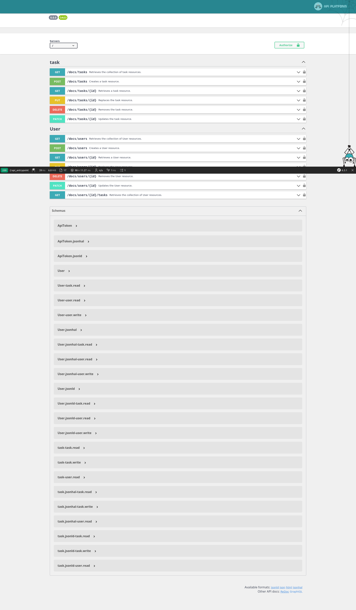

# API для Todo List

## Description
API надає можливість:
- Отримати список своїх завдань відповідно до фільтра.
- Створити своє завдання.
- Редагувати своє завдання.
- Видалити своє завдання.
- Відзначити своє завдання як виконане.


## How to run

**Docker ready project**
all variables for docker come from dot env file - so just run make build,
and you create a new instance

1. **Clone the Symfony Project Repository:**
   ```bash
   git clone https://github.com/ZhoraKornev/task_planner.api
   cd task_planner.api
   ```

2. **Prepare Docker Compose File:**
   Create a `docker-compose.override.yml` file in the root of your Symfony project directory.
   Add the necessary services like PHP, Nginx/Apache, MySQL, etc., along with relevant configurations.

3. **Build and Start Docker Containers:**
   In your terminal, run the following command to build and start the Docker containers:
   ```bash
   docker-compose up -d
   ```

4. **Access PHP Bash in the Docker Container:**
   To enter the PHP container's bash, use the following command:
   ```bash
   docker-compose exec php bash
   ```

5. **Install Project Dependencies with Composer:**
   Once inside the PHP container, navigate to the Symfony project root directory and run Composer to install project dependencies:
   ```bash
   composer install
   ```

6. **Symfony's Command Execution:**
   After installing the dependencies, you can run Symfony's commands as needed, for example:
   ```bash
   bin/console cache:clear
   bin/console doctrine:migrations:migrate
   bin/console doctrine:fixtures:load
   ```

7. **Access the Symfony Application:**
   Once everything is set up, you should be able to access your Symfony application in your web browser by visiting `http://localhost` (or as configured in your `docker-compose.yml`).
    Use test user email and pass from fixtures
   ```bash
   App\DataFixtures\AppFixtures::TEST_USER_EMAIL('test@user.email')
   App\DataFixtures\AppFixtures::TEST_USER_PASS(123)
   ```
8. **Stop Docker Containers:**
   When you're done with your work, you can stop and remove the Docker containers using:
   ```bash
   docker-compose down
   ```

Remember to adjust the commands and file names according to your specific Symfony project and Docker Compose configuration.

Happy coding! 🚀


## Helpful docs

Open api 3 ready.
You can find all docs and endpoints in http://localhost/api_documentation section



### Tech stack

 nginx
 php 8.2
 mariadb 10.10.3
 rabbitmq
 symfony 6.3


